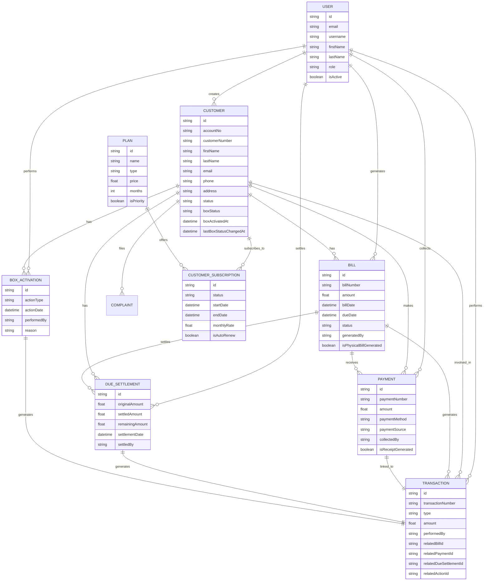

# Enhanced Cable Billing System ERD

## Key Entities and Relationships

## Summary of Key Changes

1. **Enhanced Financial Tracking**:
   - Bills now track which staff member generated them (`generatedBy`)
   - Payments track collection source and staff member who collected them (`paymentSource`, `collectedBy`)
   - Due settlements track which staff member processed them (`settledBy`)
   - All financial operations automatically create Transaction records

2. **Box Activation Tracking**:
   - Customers now have box status fields (`boxStatus`, `boxActivatedAt`, `lastBoxStatusChangedAt`)
   - New BoxActivation model tracks all service actions (ACTIVATED, SUSPENDED, DEACTIVATED, REACTIVATED)
   - Every box action creates a corresponding Transaction record

3. **Centralized Transaction Logging**:
   - All financial and service actions create Transaction records
   - Transactions can be linked to Bills, Payments, DueSettlements, and BoxActivations
   - All transactions track which staff member performed them (`performedBy`)