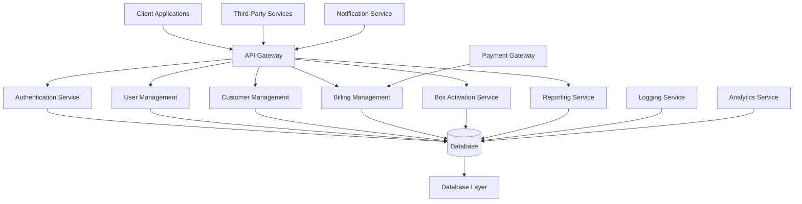

# System Architecture

This document provides a high-level overview of the Cable Management System architecture after implementing the enhancements.

## Overview

The Cable Management System is a comprehensive solution for managing cable TV billing, customer service, and set-top box activations. The system follows a modular architecture with clear separation of concerns.

## High-Level Architecture



## Module Architecture

### Core Modules

#### 1. Authentication Service
- Handles user authentication and authorization
- JWT-based token management
- Role-based access control

#### 2. User Management
- Staff member management
- Role assignment and permissions
- User profile management

#### 3. Customer Management
- Customer registration and profile management
- Account status tracking
- Contact information management

#### 4. Billing Management
- Bill generation and tracking
- Payment processing
- Due settlement management
- Transaction logging

#### 5. Box Activation Service
- Set-top box status tracking
- Service action logging
- Customer box status management

#### 6. Reporting Service
- Financial reporting
- Service activity reports
- Performance analytics

## Data Flow

### 1. Customer Registration
```
Client → Customer Management → Database
```

### 2. Bill Generation
```
Staff → Billing Management → 
  Update Customer (next bill date) → 
  Create Bill Record → 
  Create Transaction Record → 
  Database
```

### 3. Payment Processing
```
Client/Staff → Billing Management → 
  Update Bill Status → 
  Create Payment Record → 
  Create Transaction Record → 
  Database
```

### 4. Box Activation
```
Staff → Box Activation Service → 
  Update Customer Box Status → 
  Create Box Activation Record → 
  Create Transaction Record → 
  Database
```

## Database Schema

### Core Entities

#### Users
- Authentication and authorization
- Staff member profiles
- Role management

#### Customers
- Customer profiles
- Account information
- Service subscriptions
- Box status tracking

#### Bills
- Billing records
- Amounts and due dates
- Status tracking

#### Payments
- Payment records
- Payment methods
- Collection tracking

#### Transactions
- Centralized ledger
- Financial activity logging
- Audit trail

#### Box Activations
- Service action records
- Box status changes
- Staff tracking

## Security Architecture

### Authentication
- JWT-based authentication
- Token expiration and refresh
- Secure password handling

### Authorization
- Role-based access control
- Resource-level permissions
- Staff-customer data separation

### Data Protection
- Database encryption
- Secure API communication
- Input validation and sanitization

## Integration Points

### Internal Services
- Logging service for audit trails
- Notification service for alerts
- Analytics service for reporting

### External Services
- Payment gateways for online payments
- SMS/email services for notifications
- CRM systems for customer management

## Scalability Considerations

### Horizontal Scaling
- Stateless API services
- Load balancer support
- Database connection pooling

### Performance Optimization
- Database indexing
- Caching strategies
- Query optimization

### Monitoring and Logging
- Comprehensive logging
- Performance metrics
- Error tracking

## Deployment Architecture

### Development Environment
- SQLite for local development
- Hot reloading for rapid development
- Local testing infrastructure

### Production Environment
- PostgreSQL database
- Load balancer
- Multiple application instances
- Monitoring and alerting

## Technology Stack

### Backend
- Node.js with TypeScript
- Express.js framework
- Prisma ORM
- PostgreSQL database

### Frontend (Conceptual)
- React/Vue.js for admin panel
- Mobile apps for field staff
- Customer portal

### Infrastructure
- Docker for containerization
- Kubernetes for orchestration
- CI/CD pipelines
- Monitoring tools

## Future Architecture Enhancements

### Microservices
- Break down monolith into microservices
- Event-driven architecture
- Message queue integration

### Cloud-Native Features
- Serverless functions
- Managed database services
- Auto-scaling capabilities

### Advanced Analytics
- Real-time data processing
- Machine learning integration
- Predictive analytics

## Conclusion

The enhanced Cable Management System architecture provides a robust, scalable, and secure foundation for managing cable TV billing and service operations. The modular design allows for easy maintenance and future enhancements while ensuring data integrity and security.